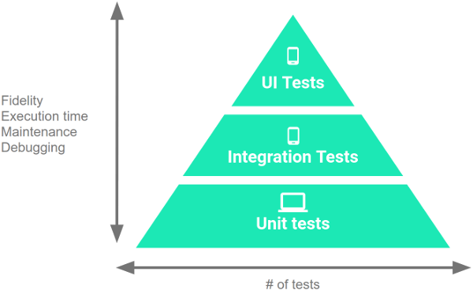

## PDZ - Testes no Android

### Conceitos

* Testes unitários
* Testes de User interface


* Pirâmide de testes



Em resumo, a pirâmide de testes é uma estratégia de divisão de testes em um projeto. 

Parte inferior: rápidos, baratos e isolados ao comportamento da aplicação. 
Parte superior: lentos, caros e integrados.

#### Níveis da pirâmide de testes
Testes pequenos são testes de unidade que validam o comportamento do app, uma classe por vez.
Testes médios são testes de integração que validam interações entre níveis da pilha dentro de um módulo ou interações entre módulos relacionados.
Testes grandes são testes de ponta a ponta que validam as jornadas do usuário, abrangendo vários módulos do app.

#### Recomendação
```text
70% testes small ou unitários
20% testes medium ou integrados
10% testes large ou end-to-end
```

### Testes unitários

* Não instrumentados
* São executados sem a necessidade de um emulador ou um dispositivo
* Ficam no pacote `test`

* Ferramentas utilizadas no app
    * JUnit4

    * Robolectric
        - Permite executar testes dentro de um sandbox que simula o comportamento do Android de forma assertiva, sem utilizar emulador/dispositivo. Os testes são executados dentro da JVM.

    * Biblioteca `Truth` para declarações de assertividade mais legíveis
        Ex:
        ```kotlin
        assertThat(obj).hasFlags(FLAGS)
        assertThat(obj).doesNotHaveFlags(FLAGS)
        assertThat(intent).hasData(URI)
        assertThat(extras).string(string_key).equals(EXPECTED)
        ```

### Testes de UI - Framework Espresso

* Instrumentados
* Rodam no emulador ou dispositivo
* Ficam no pacote `androidTest`

```kotlin
@Test
fun greeterSaysHello() {
    onView(withId(R.id.name_field)).perform(typeText("Steve"))
    onView(withId(R.id.greet_button)).perform(click())
    onView(withText("Hello Steve!")).check(matches(isDisplayed()))
}
```

- Conceitos chave
    * Espresso: ponto de entrada para interações com visualizações (via onView() e onData()). Também expõe APIs que não estão necessariamente vinculadas a nenhuma visualização, como pressBack().
    * ViewMatchers: um conjunto de objetos que implementam a interface Matcher<? super View>. Você pode transmitir um ou mais deles ao método onView() para localizar uma visualização na hierarquia atual.
    * ViewActions: um conjunto de objetos ViewAction que podem ser transmitidos para o método ViewInteraction.perform(), como click().
    * ViewAssertions: um conjunto de objetos ViewAssertion que podem ser transmitidos ao método ViewInteraction.check(). Na maioria das vezes, você usará a declaração de correspondências, que usa um matcher de visualização para declarar o estado da visualização selecionada no momento.


#### Fontes:
* https://developer.android.com/training/testing/fundamentals
* https://developer.android.com/training/testing/unit-testing
* https://developer.android.com/training/testing/espresso
* http://robolectric.org/getting-started/
* https://medium.com/android-dev-br/explorando-a-pir%C3%A2mide-de-testes-no-android-parte-1-18ea135808df